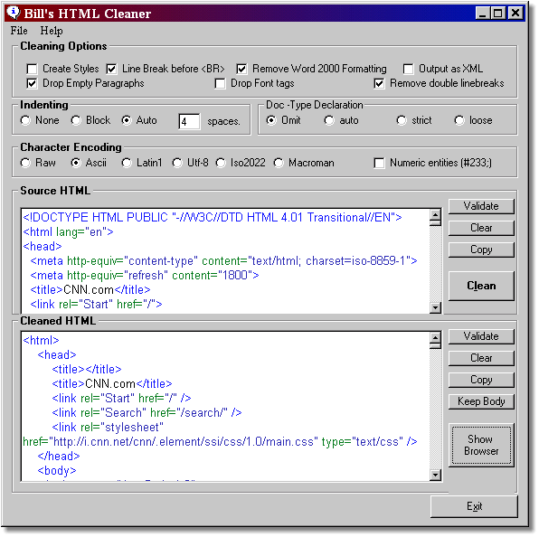



## HTML and MS Word Cleaner

### Description

This project was built as a GUI front end to Andre Blavier's wrapper around the TidyCom Dll.

It cleans up HTML source and is a great MS Word HTML cleaner as well.

It is also useful as a block indenting tool for HTML source.

TidyCOM is a Windows COM component wrapping Dave Raggett's HTML Tidy, a free utility

application from the World Wide Web Consortium that helps you clean up your web pages.

HTML Tidy is available from the W3C as a command-line program, la Unix.

To better fit in the Windows environment Andre has written COM component wrapper

for Tidy available here:

http://perso.wanadoo.fr/ablavier/TidyCOM/

The Tidy SourceForge object is here:

http://tidy.sourceforge.net/
 
### More Info
 
You must register the attached TidyCom.dll

             |
---                |---
**Submitted On**   |2002-12-18 12:09:00
**By**             |[Bill MacIntyre](https://github.com/Planet-Source-Code/PSCIndex/blob/master/ByAuthor/bill-macintyre.md)
**Level**          |Intermediate
**User Rating**    |3.8 (23 globes from 6 users)
**Compatibility**  |VB 6\.0
**Category**       |[Internet/ HTML](https://github.com/Planet-Source-Code/PSCIndex/blob/master/ByCategory/internet-html__1-34.md)
**World**          |[Visual Basic](https://github.com/Planet-Source-Code/PSCIndex/blob/master/ByWorld/visual-basic.md)
**Archive File**   |[HTML\_and\_M153938242003\.zip](https://github.com/Planet-Source-Code/bill-macintyre-html-and-ms-word-cleaner__1-42955/archive/master.zip)

